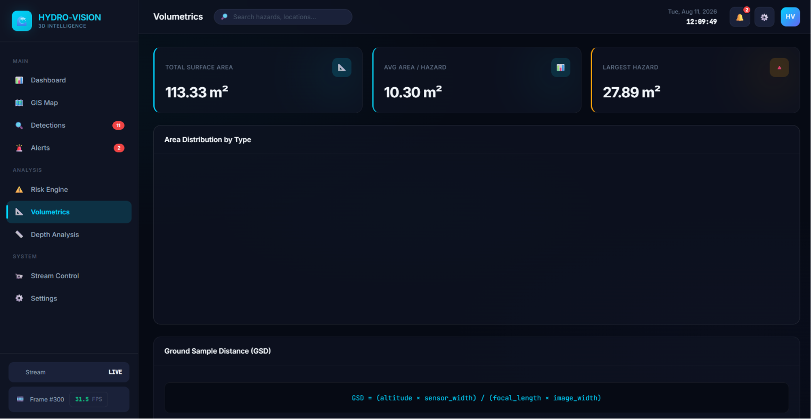
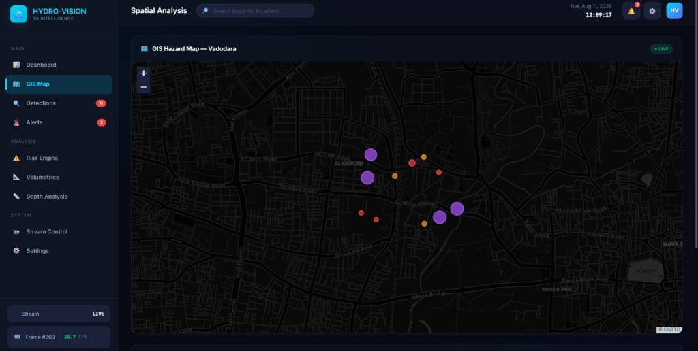
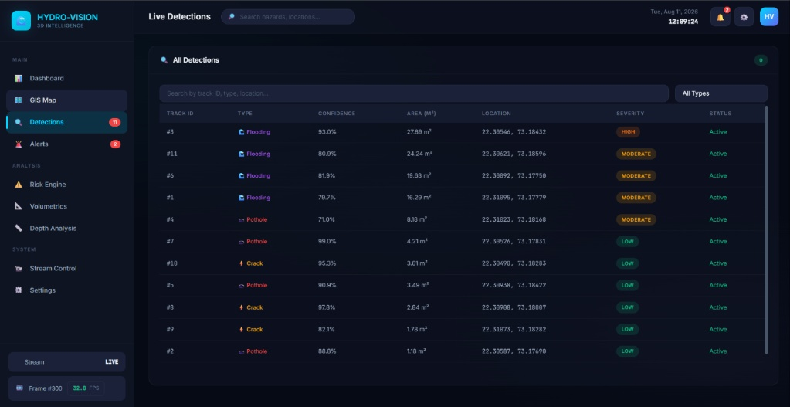
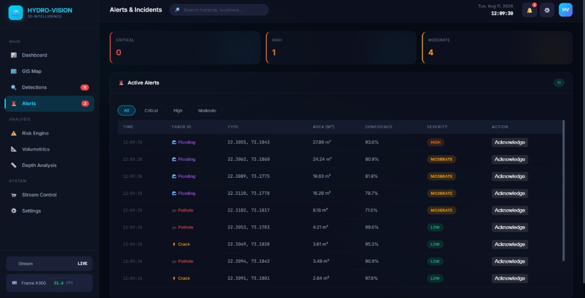
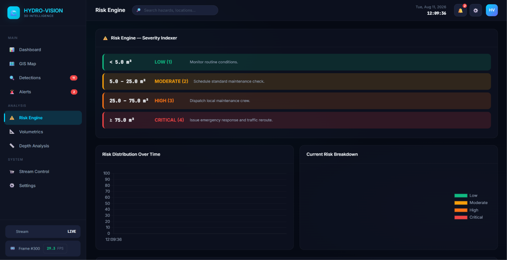

# 🌊 HYDRO-VISION-3D

<p align="center">
  <strong>AI-Powered Real-Time Road Hazard & Waterlogging Intelligence for Smart Cities</strong><br>
  Team AeroRaven &nbsp;•&nbsp; ELCIA Tech Summit 2026 Hackathon
</p>

<p align="center">
  
  
  
  
  
  
  
</p>

---

## 📖 Overview

**HYDRO-VISION-3D** turns raw drone/CCTV road footage into a **live, geo-located hazard intelligence dashboard**.

A FastAPI backend runs each video frame through a custom-trained **YOLOv8** detection-and-tracking pipeline, converts pixel-space detections into **estimated real-world surface area (m²)** using a camera-geometry model, assigns each hazard a **severity level and maintenance priority score**, geo-locates it against **Vadodara municipal zones**, and streams everything to a live web dashboard over **WebSocket** — no page refresh, no polling.

Built as a working prototype for municipal AP/infrastructure teams who currently rely on manual road inspections and citizen complaints. It demonstrates the full pipeline end-to-end on real drone footage — detection, geometry, risk scoring, and a live operational dashboard — as a foundation for a production deployment.

---

## ✨ Key Features

| Capability | Description |
|---|---|
| 🎯 **Real-time Detection + Tracking** | YOLOv8 model tracks each hazard across frames with a persistent `track_id`, so the same pothole isn't double-counted frame to frame |
| 📐 **Pixel → Real-World Area Conversion** | Custom `MetricMapper` converts bounding-box pixel area into estimated square meters based on frame geometry (a geometric approximation, not a calibrated survey measurement) |
| 🧮 **EMA Smoothing** | Area readings are smoothed frame-to-frame (`0.7 × previous + 0.3 × current`) to suppress detection jitter |
| 🚦 **Automated Severity Indexing** | Every hazard is auto-classified LOW / MODERATE / HIGH / CRITICAL based on affected area, each with a recommended action |
| 🗺️ **GIS Zone Assignment** | Detections are auto-mapped to Vadodara municipal ward zones (e.g. *Sayajigunj*, *Akota/Gotri*, *Makarpura/GIDC*) using lat/lon rules |
| 📊 **Priority Scoring** | A 1–100 maintenance priority score is computed per hazard from severity, area, and hazard type |
| 📸 **Visual Evidence Capture** | Each new hazard is auto-cropped and saved as a snapshot image, linked directly from its dashboard record |
| 🔴 **Live WebSocket Streaming** | The dashboard subscribes over `/ws/live-stream` and receives hazard updates in real time — no polling |
| 🖥️ **Full Operations Dashboard** | 7-page dashboard: Overview, GIS Map, Detections, Alerts, Risk Engine, Volumetrics, and Stream Control |
| 🎫 **Maintenance Ticket Lifecycle** | Each hazard has a status (`OPEN` → `IN_PROGRESS` → `RESOLVED`) updatable via REST API |
| 🌐 **GeoJSON Export** | `/api/hazards/geojson` exposes all active hazards as a standard GeoJSON `FeatureCollection` for use in any external GIS tool |

---

## 🏗 System Architecture

```text
                  ┌────────────────────────┐
                  │   Drone / CCTV Video    │
                  │   (master_video.mp4)    │
                  └───────────┬────────────┘
                              │  frame-by-frame
                              ▼
                  ┌────────────────────────┐
                  │  PerceptionEngine       │
                  │  (YOLOv8 detect+track)  │
                  └───────────┬────────────┘
                              │  class, conf, bbox, track_id
                              ▼
                  ┌────────────────────────┐
                  │  MetricMapper           │
                  │  pixel area → m²        │
                  └───────────┬────────────┘
                              │
                              ▼
                  ┌────────────────────────┐
                  │  GeoTranslator          │
                  │  bbox → lat/lon         │
                  └───────────┬────────────┘
                              │
                              ▼
                  ┌────────────────────────┐
                  │  SeverityIndexer        │
                  │  area → LOW..CRITICAL   │
                  └───────────┬────────────┘
                              │
                              ▼
                  ┌────────────────────────┐
                  │  FastAPI Backend        │
                  │  state + REST + WS      │
                  └───────────┬────────────┘
                              │  broadcast over WebSocket
                              ▼
                  ┌────────────────────────┐
                  │  Live Dashboard (SPA)   │
                  │  Charts · Map · Tables  │
                  └────────────────────────┘
```

---

## 🧠 Technology Stack

| Layer | Technology | Why |
|---|---|---|
| **Detection & Tracking** | YOLOv8 (Ultralytics) with built-in tracker | Fast, well-supported, native `.track()` gives persistent IDs out of the box |
| **Computer Vision** | OpenCV | Video I/O, frame decoding, snapshot cropping |
| **Backend / API** | FastAPI + Uvicorn | Async-native, first-class WebSocket support, auto-generated OpenAPI docs |
| **Realtime Transport** | Native WebSocket (`/ws/live-stream`) | Push-based updates — dashboard reflects new detections within milliseconds, no polling overhead |
| **Frontend** | Vanilla JavaScript (ES6 classes) | Zero build step — runs directly in-browser, easy to demo on any machine |
| **Charts** | Chart.js | Live-updating timeline, severity donut, hazard-type bar chart, risk gauge |
| **Mapping** | Leaflet.js + CARTO dark tiles | Lightweight, no API key required, live-updating hazard markers |
| **State** | In-process Python dict (`latest_system_state`) | No DB dependency for the hackathon build — keeps setup to a single `pip install` |

---

## 📂 Repository Structure

```text
hydro-vision-3D/
├── data/
│   └── raw_videos/               # Drop your source footage here (see below)
│       └── master_video.mp4
├── models/
│   └── checkpoints/
│       └── road_hazards_yolov8.pt
├── src/
│   ├── backend/
│   │   └── app.py                # FastAPI app — REST + WebSocket + pipeline loop
│   ├── ingestion/
│   │   └── stream_loader.py      # Frame generator (frame_id, timestamp, frame)
│   ├── perception/
│   │   └── mask_extractor.py     # PerceptionEngine — YOLOv8 detect + track
│   ├── geometry/
│   │   ├── metric_mapper.py      # Pixel area → real-world m²
│   │   └── geo_utils.py          # Pixel bbox → lat/lon
│   ├── analytics/
│   │   └── severity_indexer.py   # Area → severity level + action
│   └── run_perception.py         # Standalone CLI pipeline runner (no dashboard)
├── frontend/
│   ├── index.html
│   ├── script.js
│   └── style.css
├── static/
│   └── snapshots/                 # Auto-saved hazard evidence images
├── config/
│   └── camera_intrinsics.json
├── docs/
│   └── screenshots/                # Dashboard screenshots — see checklist below
├── requirements.txt
└── README.md
```

---

## 🚀 Getting Started

### 1. Clone & set up the environment

```bash
git clone https://github.com/<your-username>/hydro-vision-3D.git
cd hydro-vision-3D

conda create -n hydrovision python=3.11
conda activate hydrovision

pip install -r requirements.txt
```

### 2. Add your video

Place your drone/CCTV footage in `data/raw_videos/`. Name it with `master` or `combined` in the filename (e.g. `master_video.mp4`) — the backend automatically resolves this file on startup. If no such file is found, it falls back to the first `.mp4` in that folder.

### 3. Start the backend

```bash
python -m uvicorn src.backend.app:app --host 0.0.0.0 --port 8000 --reload
```

On startup you should see the pipeline auto-resolve your video and begin streaming once a dashboard client connects:

```
[INFO] Client connected. Active connections: 1
[INFO] Auto-starting stream loop with: data/raw_videos/master_video.mp4
[INIT] Loading AI Pipeline Components...
```

### 4. Open the dashboard

Open `frontend/index.html` directly in a browser, or serve it via the backend's static mount at `http://localhost:8000/`. The dashboard connects automatically — no configuration needed for a local demo.

### 5. (Optional) Run the pipeline standalone, without the dashboard

Useful for quickly checking detections in the terminal:

```bash
python src/run_perception.py data/raw_videos/master_video.mp4
```

---

## 🔌 API Reference

| Method | Endpoint | Description |
|---|---|---|
| `GET` | `/api/health` | System health + current stream status |
| `GET` | `/api/stream/start` | Starts the AI pipeline on a video (defaults to auto-resolved master video) |
| `GET` | `/api/stream/stop` | Stops the stream and resets state |
| `GET` | `/api/hazards` | Current cumulative hazard state (JSON) |
| `GET` | `/api/hazards/geojson` | All hazards as a GeoJSON `FeatureCollection` |
| `POST` | `/api/hazards/status` | Update a hazard's ticket status (`OPEN` / `IN_PROGRESS` / `RESOLVED`) |
| `GET` | `/api/config` | Camera intrinsics + severity threshold configuration |
| `GET` | `/api/debug/video-path` | Diagnostic: confirms which video file was resolved and whether it opens correctly |
| `WS` | `/ws/live-stream` | Live hazard broadcast — subscribe here for real-time dashboard updates |

Interactive Swagger docs are auto-generated by FastAPI at `http://localhost:8000/docs`.

---

## 📊 Severity & Risk Model

| Level | Affected Area | Recommended Action |
|---|---:|---|
| 🟢 LOW | < 5 m² | Monitor routine conditions |
| 🟡 MODERATE | 5 – 25 m² | Schedule standard maintenance check |
| 🟠 HIGH | 25 – 75 m² | Dispatch local maintenance crew |
| 🔴 CRITICAL | ≥ 75 m² | Issue emergency response and traffic reroute |

Priority scores (1–100) additionally weight hazard type — waterlogging and open manholes score higher than equivalent-area cracks, reflecting real safety risk.

## 💻 Development & Runtime Environment

Built and demoed on:

| Component | Spec |
|---|---|
| GPU | NVIDIA RTX 4060 |
| CPU | Intel i9-14900HX |
| RAM | 16 GB+ recommended (pipeline + browser + IDE running concurrently) |
| OS | Windows 11 (PowerShell / VS Code) |
| Python | 3.11 |

> These specs reflect the demo machine, not a hard requirement — the pipeline runs on CPU as well, at a lower FPS. YOLOv8 will automatically use CUDA if a compatible GPU + PyTorch build is detected, and fall back to CPU otherwise.

---

## 📊 Observed Performance

Measured live during development on the hardware above, running the full FastAPI + WebSocket + dashboard pipeline end-to-end (not just raw model inference):

| Metric | Observed |
|---|---:|
| Processing rate | ~30 FPS on 1080p footage |
| Detection confidence threshold | 0.25 (tuned to catch marginal/partial hazards) |
| End-to-end latency (frame → dashboard update) | Sub-second over local WebSocket |

> These are real numbers from our own test runs on the hardware above, not vendor benchmarks — expect them to vary with video resolution, hazard density per frame, and whether GPU acceleration is active.

---

| Typical Pothole-Detection Demo | HYDRO-VISION-3D |
|---|---|
| Bounding box only | Bounding box **+ persistent tracking ID** across frames |
| Pixel-space output | Converted to **real-world m²** |
| One-shot detection | **EMA-smoothed** continuous tracking, avoids flicker/double-count |
| No location context | Auto-mapped to **municipal ward zones** |
| No workflow | Full **ticket lifecycle** (open → in progress → resolved) via API |
| Static report | **Live WebSocket dashboard** — updates as the video plays |

---

## 🛣 Roadmap

- ✅ Real-time detection + tracking pipeline
- ✅ Live WebSocket dashboard (7 pages: Overview, Map, Detections, Alerts, Risk, Volumetrics, Stream Control)
- ✅ GeoJSON export + REST API
- ✅ Automated severity & priority scoring
- ⬜ Persistent database (PostGIS) for historical trend analysis
- ⬜ Monocular depth estimation for volumetric (m³) water/pothole estimates
- ⬜ Multi-camera / multi-zone concurrent ingestion
- ⬜ Mobile field-crew app for ticket resolution

---

## 📸 Dashboard Screenshots

> **Screenshot checklist** — capture each page below at `1920×1080`, save into `docs/screenshots/` using the exact filenames shown, and they will render automatically wherever this README is viewed on GitHub.

| # | Page | Filename |
|---|---|---|
| 1 | Infrastructure Overview (main dashboard) | `docs/screenshots/01-dashboard-overview.png` |
| 2 | GIS Hazard Map (Vadodara, live markers) | `docs/screenshots/02-gis-map.png` |
| 3 | Live Detections table | `docs/screenshots/03-detections.png` |
| 4 | Alerts & Incidents | `docs/screenshots/04-alerts.png` |
| 5 | Risk Engine | `docs/screenshots/05-risk-engine.png` |
| 6 | Volumetrics | `docs/screenshots/06-volumetrics.png` |
| 7 | Stream Control Panel | `docs/screenshots/07-stream-control.png` |

<p align="center">
  
</p>

<p align="center">
  
</p>

<p align="center">
  
</p>

<p align="center">
  
</p>

<p align="center">
  
</p>

<p align="center">
  
</p>

<p align="center">
  
</p>

---

## 👥 Team

**Team AeroRaven** — built for the ELCIA Tech Summit 2026 Hackathon.

---

## 🤝 Contributing

1. Fork the repository
2. Create a feature branch (`git checkout -b feature/your-feature`)
3. Commit your changes
4. Open a Pull Request

---

<p align="center"><sub>HYDRO-VISION-3D — AI-Powered Infrastructure Intelligence for Smart Cities</sub></p>