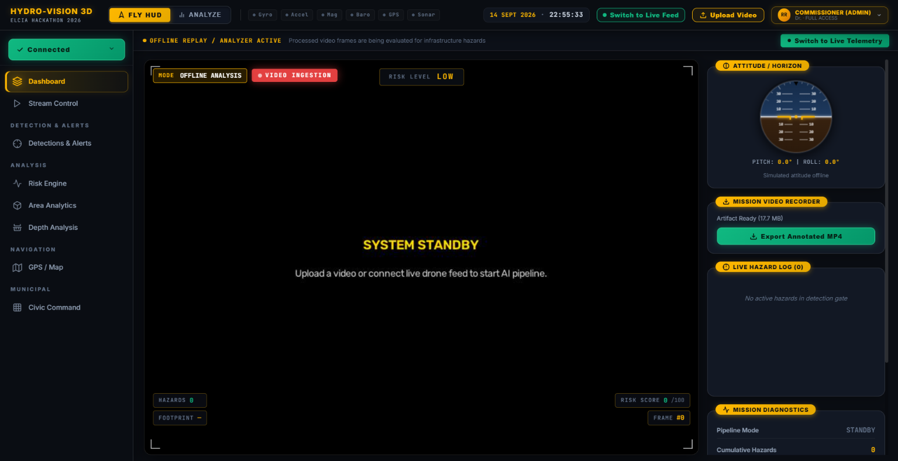

# HYDRO-VISION-3D

**AI-powered ground control station for monsoon, road and civic infrastructure intelligence.**

Takes drone or inspection video and produces a ranked, evidence-backed municipal repair worklist — not a stream of frame-level detections.



> **First Prize** — ELCIA Next-Gen Innovative Tech Hackathon 2026, Smart City Drone-AI Challenge
> ELCIA Tech Summit 2026, Bengaluru

---

## The problem this solves

A one-minute drone flight produces thousands of frame-level detections. A municipal engineer cannot act on thousands of anything.

HYDRO-VISION-3D tracks each physical hazard across the video and collapses it into a **single incident record** carrying one evidence photograph, one severity score and one position — then ranks those incidents so a civic team knows what to fix first.

```
Video → Detection → Tracking → Incident → Evidence → Severity → Spatial Context → Municipal Action
```

**YOLO is the perception layer. The system around it provides the operational context.**

---

## Hazard classes

| ID | Class |
|---|---|
| 0 | `damaged_footpath` |
| 1 | `drainage_overflow` |
| 2 | `open_manhole` |
| 3 | `potholes` |
| 4 | `waterlogging_area` |

---

## Results

**Model** — YOLOv8m, 8,063 images, 22,099 bounding-box annotations

| Metric | YOLOv8s baseline | YOLOv8m final |
|---|---|---|
| Precision | 0.648 | **0.734** |
| Recall | 0.547 | **0.640** |
| mAP50 | 0.599 | **0.646** |
| mAP50-95 | 0.356 | **0.360** |

**Per class** — reported separately because an aggregate metric hides a weak class:

| Class | mAP50 |
|---|---|
| `drainage_overflow` | 0.941 |
| `open_manhole` | 0.927 |
| `potholes` | 0.698 |
| `waterlogging_area` | 0.458 |
| `damaged_footpath` | 0.201 |

**Consolidation** — full pipeline run over a 2,802-frame test video:

| | |
|---|---|
| Raw tracks | 114 |
| Confirmed incidents | **46** |

The confirmation rate is not model precision. It is the proportion of raw tracks that met the temporal persistence criteria.

**Domain adaptation** — measured on held-out target footage:

| Test | Before | After |
|---|---|---|
| Pothole confidence (peak) | 0.27 | **0.54** |
| Dry-earth false positive (waterlogging) | 0.76–0.81 | **< 0.11** |

Full methodology and derivations: [`docs/`](docs/)

---

## Quick start

**Requirements** — Python 3.10+, Node 18+. CUDA or Apple MPS recommended; CPU works but is substantially slower.

```bash
git clone https://github.com/Luciifer71/hydro-vision-3D.git
cd hydro-vision-3D

python -m venv .venv
source .venv/bin/activate          # Windows: .venv\Scripts\activate
pip install -r requirements.txt
python main.py                     # backend on :8000
```

In a second terminal:

```bash
cd frontend
npm install
npm run dev                        # UI on :5173
```

Start the backend first, or the dev proxy will report connection errors. Trained weights (`best.pt`) are not in the repository — see [Weights](#weights).

---

## Architecture

```
          DRONE / INSPECTION VIDEO
                     │
                     ▼
        ┌────────────────────────┐
        │  Detection + Tracking  │   YOLOv8m · ByteTrack
        └───────────┬────────────┘
                    ▼
        ┌────────────────────────┐
        │   Incident Layer       │   consolidation · evidence
        │                        │   severity · spatial context
        └───────────┬────────────┘
                    ▼
        ┌────────────────────────┐
        │   FastAPI Backend      │   REST + WebSocket
        └───────────┬────────────┘
                    ▼
        ┌────────────────────────┐
        │  React Ground Control  │
        └───────────┬────────────┘
                    ▼
       GIS  ·  Analytics  ·  Civic Workflow
```

**Interface pages** — Dashboard · Stream Control · Detections & Alerts · Risk Engine · Area Analytics · Depth Analysis · GPS / Map · Civic Command

---

## Design decisions

**Severity is not confidence.** A model being 95% certain it found a crack does not make that crack urgent.

```
S = 0.45·class_risk + 0.25·extent + 0.15·persistence + 0.15·confidence
```

Weights are published and stored in every session bundle, so any score can be recomputed by hand. Band boundaries are *derived* from each class's possible score range — an open manhole can reach CRITICAL, a pothole mathematically cannot. Full derivation: [`docs/SEVERITY.md`](docs/SEVERITY.md)

**If it cannot be computed, it is null.** Ground area needs verified altitude. Without one, `area_m2` returns `null` with a machine-readable reason (`no_altitude`, `oblique_view`, `no_intrinsics`) and the interface renders an em-dash. No fallback constants, anywhere.

**Coordinates are never invented.** Every position carries a `geo_source` of `telemetry`, `manual_anchor`, `synthetic` or `none`. Synthetic paths are badged in the UI.

**Relative depth, never metric.** Depth Anything V2 emits per-frame normalised relative inverse depth. It is used as a unitless 0–1 ranking index. No depth in centimetres and no volume figure is reported anywhere.

**Runtime configuration.** Altitude, camera intrinsics, per-class thresholds, area ceilings, tracking parameters and severity weights live in `config/runtime.json`, read once per session.

```
GET  /api/config          POST /api/config          POST /api/config/reset
```

---

## Known limitations

Stated plainly, because a system that hides these is not usable in the field.

- **`damaged_footpath` (0.201) and `waterlogging_area` (0.458)** are substantially weaker than the other three classes. The dataset is heavily imbalanced — roughly 72× more pothole annotations than drainage-overflow.
- **Metric area requires verified altitude and camera calibration.** Area scales with altitude², so a wrong altitude produces a badly wrong number. The system returns null rather than guessing.
- **Monocular depth is not metric depth.** No volume is reported.
- **Geographic accuracy requires valid telemetry.** Without it, hazards keep frame number, timestamp and evidence, but no coordinates.
- **The severity model is a documented heuristic**, not calibrated against real municipal repair-urgency data — no such dataset was available.
- **Performance varies with city, camera, altitude, lighting and weather.** Cross-domain validation is ongoing.
- **Safety-critical maintenance decisions should retain a human verification step.**

---

## Documentation

| Document | Contents |
|---|---|
| [`docs/SEVERITY.md`](docs/SEVERITY.md) | Severity formula, weight justification, band derivation, worked examples |
| [`TRAINING.md`](TRAINING.md) | Dataset preparation, training configuration, reproduction steps |

---

## Repository structure

```
hydro-vision-3D/
├── config/          runtime configuration
├── docs/            methodology documents
├── frontend/        React ground control station
├── scripts/         dataset tooling, validation, diagnostics
├── src/             perception, spatial, telemetry, schema
├── tools/           evaluation and reporting
├── main.py          FastAPI backend and pipeline
└── train.py         model training
```

### Weights

Trained weights and datasets are excluded from version control by size. To reproduce from scratch, see [`TRAINING.md`](TRAINING.md). For the trained model, please contact the team.

---

## Usage and permissions

**© 2026 Krishay Shah and Tatva Shah. All rights reserved.**

This repository is published for **review, evaluation and reference**. It is not released under an open-source licence.

You may read the code, run it locally to evaluate it, and cite it with attribution.

You may **not**, without prior written permission:

- use it or any derivative in a commercial product or service
- deploy it operationally, including in municipal or government contexts
- redistribute it, in whole or in part, modified or unmodified
- present it or any derivative as your own work in a competition, academic submission or portfolio

For collaboration, pilot deployment or academic use, please open an issue or contact the team.

### Third-party components

This project depends on open-source software under its own licences, which apply independently of the notice above. In particular, **Ultralytics YOLOv8 is distributed under AGPL-3.0**, which carries obligations for derivative and network-deployed works. Anyone intending to use this project commercially should review the licences of all dependencies — and their own obligations — before doing so.

Training datasets are third-party and subject to their original licensing and attribution terms, which should be reviewed before redistribution.

---

## Team

**Drone404** — GSFC University, Vadodara

| | |
|---|---|
| Krishay Shah | B.Tech Computer Science & Engineering |
| Tatva Shah | B.Tech Computer Science & Engineering |

First Prize · ELCIA Next-Gen Innovative Tech Hackathon 2026 · Smart City Drone-AI Challenge
Organised by ELCIA in collaboration with IIIT-Bangalore and VLSI System Design